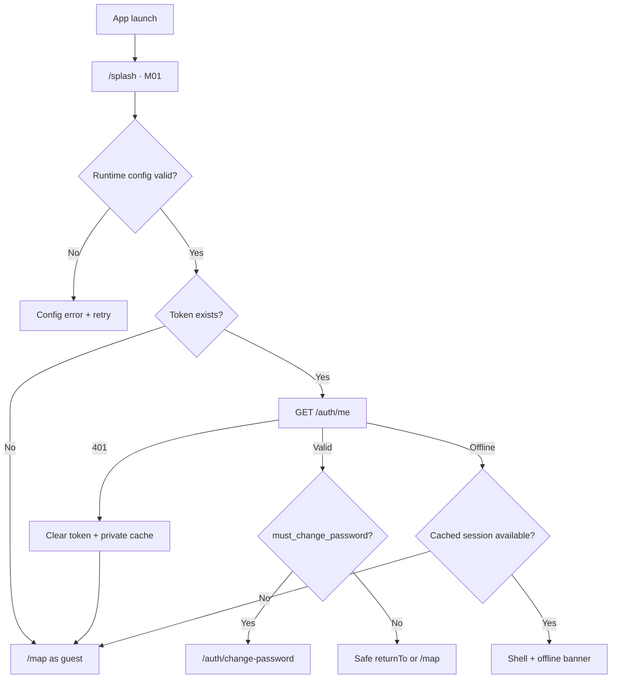

# Navigation Map — Mobile GIS Cẩm Phả

## Principles

- Guest-first; public screens never require login at app start.
- `StatefulShellRoute.indexedStack` retains tab stack, map camera and list scroll.
- Auth is an overlay/full-screen flow outside shell; successful auth consumes validated `returnTo`.
- Server permissions decide actions; direct forbidden deep link shows explicit state.
- Route params are IDs only; no token, PII, full GeoJSON or presigned URL in URI.

## Bootstrap

## Shell: 5 Tabs

Bottom order follows source specification:

| Index | Label | Root route | Screen |
|---:|---|---|---|
| 0 | Bản đồ | `/map` | M05 Map Explorer |
| 1 | Hiện trường | `/reports` | M15 report list/map |
| 2 | Tin tức | `/news` | M18 news list |
| 3 | Tài liệu | `/documents` | M20 documents/PDF |
| 4 | Cá nhân | `/profile` | M22 profile/settings/sync |

Map is default landing. NavigationBar remains hidden during map draw/measure/edit modes only when
full viewport and accidental tab changes would lose controlled interaction; mode exit restores shell.

## Route Registry

### Outside shell

| Route | Screen | Guard/result |
|---|---|---|
| `/splash` | M01 | bootstrap only |
| `/auth/login?returnTo=` | M02 | guest; auth redirects safe returnTo |
| `/auth/register?returnTo=` | M03 | guest only; auth users return back |
| `/auth/forgot-password` | auth recovery | public |
| `/auth/change-password?returnTo=` | forced/voluntary change | bearer; required session gate |
| `/auth/verify-email` | verification status | public token handled from app link without logging |

### Map branch

| Route | Screen/ownership | Guard |
|---|---|---|
| `/map` | M05 map root | public/optional auth |
| `/map/search` | M08 full-screen search | public |
| `/map/drafts` | M12 paged list | bearer + `map.draw` |
| `/map/feature/:layerId/:featureId` | M07 shareable detail; can present as page/sheet | `map.view_attributes` |
| `/map/feature/:layerId/:featureId/edit` | M13 full-screen controlled edit | exact TNMT + permission |
| `/map/feature/:layerId/:featureId/history` | M14 | exact TNMT + permission |

Map-owned transient states, not routes: layer catalog M06, GPS/weather M09, measure M10,
route M11, draw tool, feature quick sheet. State remains in map controller, not router extras.

### Reports branch

| Route | Screen | Guard |
|---|---|---|
| `/reports` | M15 public list/map | public |
| `/reports/new` | M16 stepper | bearer + `field_report.create`; guest auth returnTo |
| `/reports/mine` | M17 own list | bearer + create permission |
| `/reports/:id` | M17 detail | bearer; server owns visibility |

### News branch

| Route | Screen | Guard |
|---|---|---|
| `/news` | M18 | public |
| `/news/:id` | M19 | public content; composer auth-gated |

### Documents branch

| Route | Screen | Guard |
|---|---|---|
| `/documents` | M20 documents/PDF segmented list | public, server-filtered |
| `/documents/:id` | M21 document detail | public/optional auth |
| `/pdf-maps/:id` | M21 PDF map detail | public/optional auth |

Download action routes to login when guest, then requests a fresh presigned URL; URL never enters router.

### Profile branch

| Route | Screen | Guard |
|---|---|---|
| `/profile` | M22 guest/auth profile | public |
| `/profile/edit` | profile edit | bearer |
| `/profile/offline-queue` | sync status/items | bearer; role-aware content |
| `/profile/settings` | theme/language/permissions/privacy | public |
| `/profile/notifications` | notification preferences | bearer |

## Auth Return Flow

1. Write action builds app-local path only, e.g. `/reports/new`.
2. Encode as `returnTo`; reject absolute URL, unknown route, nested auth route and path traversal.
3. Login/register keep returnTo through verification/change-password branches.
4. Success calls router replacement to returnTo, avoiding duplicate auth page in back stack.
5. Cancel returns original public screen with unsaved in-memory draft intact where safe.
6. Expired process/memory means draft recovery comes from local draft store only after its Sprint.

## Modal / Sheet Ownership

| UI | Presentation | Back behavior |
|---|---|---|
| Layer catalog | Draggable modal bottom sheet | closes sheet, map state retained |
| Feature quick info | Draggable sheet; route only for share/deep link | closes sheet first |
| Permission primer | App modal before system dialog | cancel leaves feature inactive |
| Confirm destructive action | Action sheet/dialog by width | back = cancel |
| Conflict compare | Full-screen on phone, dialog/split panel on tablet | cannot dismiss while apply request active |
| Auth required | Full-screen auth route | cancel returns action origin |
| Map tool active | Context bar + bottom result card | first back prompts/cancels mode, second navigates |

## Back and Tab Behavior

1. Close modal/sheet.
2. If map tool has uncommitted vertices, confirm discard.
3. Pop current tab branch.
4. If at non-map tab root, system back follows platform behavior; tab switch is not synthetic history.
5. At map root, Android back exits app.
6. Re-tap active list tab scrolls to top; re-tap map tab does not reset camera.
7. Logout resets authenticated child stacks and private cached route data, then `/map` guest.

## Deep Links

Supported public links: news detail, document/PDF detail, public map feature, public report path only if
server allows viewing. Auth-required link preserves returnTo. Unknown/deleted item uses not-found state with
route back to owning tab. No arbitrary WebView URL handling.

## Responsive Navigation

- Phone portrait: bottom `NavigationBar`.
- Tablet/landscape ≥ 840dp: `NavigationRail` where map controls remain unobstructed.
- Sheets cap readable width; content center column max ~720dp, map remains full viewport.
- System keyboard can promote long forms/sheets to full-screen.
