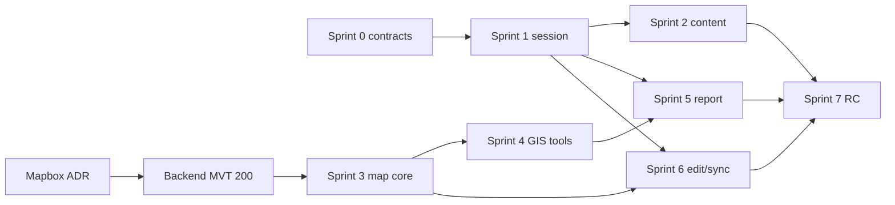

# Release Plan — Mobile GIS Cẩm Phả

## Release Goal

Phát hành Android/iOS release candidate cho sáu actor, dùng backend thật,
map + content + field operations + TNMT edit/offline trong phạm vi đã chốt,
không placeholder, không silent conflict và không lộ secret/PII.

Sprint cadence: 2 tuần. Estimate hiện tại 276 SP; velocity sẽ được hiệu chỉnh sau Sprint 1–2.
Ngày release không khóa trước khi velocity và backend blockers có evidence.

## Increments

| Sprint | Goal | Planned SP | User-visible increment | Exit gate |
|---|---|---:|---|---|
| 0 | Discovery, contract, UX foundation | 20 | Renderer POC + reviewed product/design artifacts | Basemap/GeoJSON evidence; MVT real or blocker; contracts known |
| 1 | Auth, app shell, profile | 34 | Guest/auth enter app and navigate safely | Cold restore, refresh/logout, 5 tabs, no home placeholder |
| 2 | CMS content | 36 | News/comments/docs/PDF end-to-end | Public/internal role paths, search/page/download expiry |
| 3 | Map explorer | 40 | Real Cẩm Phả layers/search/identify | Real MVT, layer controls, stable camera/performance |
| 4 | GIS tools | 40 | GPS/weather/nearby/measure/route/drafts | All tool modes cancel/undo/save with backend values |
| 5 | Field operations | 36 | Submit and track report with evidence | Real upload/create/detail, offline form, push deep link |
| 6 | TNMT editing/offline | 40 | Safe edit/history/sync conflict | Exact RBAC, version conflict, durable queue |
| 7 | Hardening/RC | 30 | Acceptance candidate | UAT/device/security/performance/release config signed |

## Milestones

### M0 — Architecture Baseline (Sprint 0)

- API/RBAC/source audit versioned.
- Renderer/licensing/platform direction accepted.
- Navigation, M01–M22 states and design system accepted.
- Known backend gaps have owner/exit evidence.

### M1 — Navigable Product (Sprint 1)

- Real shell replaces placeholder.
- Guest and authenticated lifecycle stable.
- Product can receive deep links without losing auth return context.

### M2 — Public Value (Sprint 2)

- Guest gets useful news/doc/map-PDF content.
- Internal content stays server-filtered.
- Download URLs are short-lived and fetched on demand.

### M3 — GIS Core (Sprint 3–4)

- Backend MVT and interactive tools work on device.
- GPS/geometry UX meets field accuracy expectations.
- pgRouting remains route source.

### M4 — Two-way Operations (Sprint 5)

- Citizen/capable staff creates real field evidence.
- Upload, report status and notification form one traceable workflow.

### M5 — Controlled Editing (Sprint 6)

- TNMT editing is versioned, role-protected and offline conflict-safe.

### RC — Release Candidate (Sprint 7)

- Full UAT and privacy/security/performance checks pass.
- Production config supplied through CI/dart-define, not local `.env`.

## Critical Path

## Entry Gates by Sprint

| Sprint | Required before commitment |
|---|---|
| 1 | Sprint 0 Review accepts auth/navigation/design direction |
| 2 | Session/returnTo stable; CMS serializers re-audited |
| 3 | MVT endpoint returns protobuf 200; Mapbox terms accepted for development |
| 4 | Map gesture/state ownership stable; line network fixture for route story |
| 5 | Auth/report permission fixtures; storage direct-upload reachable; image source decision |
| 6 | TNMT account + editable layer/version fixture; offline sync response fixture |
| 7 | Feature freeze; open P0/P1 defects = 0 or explicit PO waiver |

## Release Readiness Gates

### Functional

- M01–M22 accepted where in release scope.
- Public guest, citizen, UBND, TNMT, XD and admin role paths tested.
- No placeholder/dead action; all errors have recovery path.

### Quality

- `dart format`, `flutter analyze`, `flutter test` clean.
- Repository contract tests cover write payloads and envelope parsing.
- Android emulator + at least one representative physical Android.
- iOS simulator/device via macOS CI or test machine before RC.
- Map pan/zoom and image/PDF flows profiled; no blocking memory issue.

### Security/privacy

- HTTPS/WSS release guard; cleartext only Android dev flavor.
- Token only `TokenStorage`; map JWT exact host; logout clears registration/cache.
- Logs/evidence redact Authorization, refresh token, password, phone, photos, precise GPS.
- Permission copy and timing reviewed.

### Operations

- Mapbox token restriction/terms/cost reviewed.
- Firebase configs per flavor available through secure delivery.
- Crashlytics release wiring validated without PII.
- Backend API version, acceptance fixture and rollback contact recorded.

## Scope Control

- Product Backlog changes only at refinement/review; Sprint Goal remains stable.
- New package needs capability gap + compatibility + ADR.
- Backend blocker moves dependent story out; no hidden mock acceptance.
- P2 enhancement (full tile offline, in-app PDF engine, 3D terrain) enters only after P0/P1 gates.

## Demo Evidence Per Sprint

1. App/device recording of vertical slice.
2. Screenshots for loading/data/empty/error and role-specific state.
3. API request/response summary without secret/PII.
4. Analyze/test output.
5. Done/Not Done, blocker and Product Owner decision in `SPRINTS/SPRINT_NN.md`.
